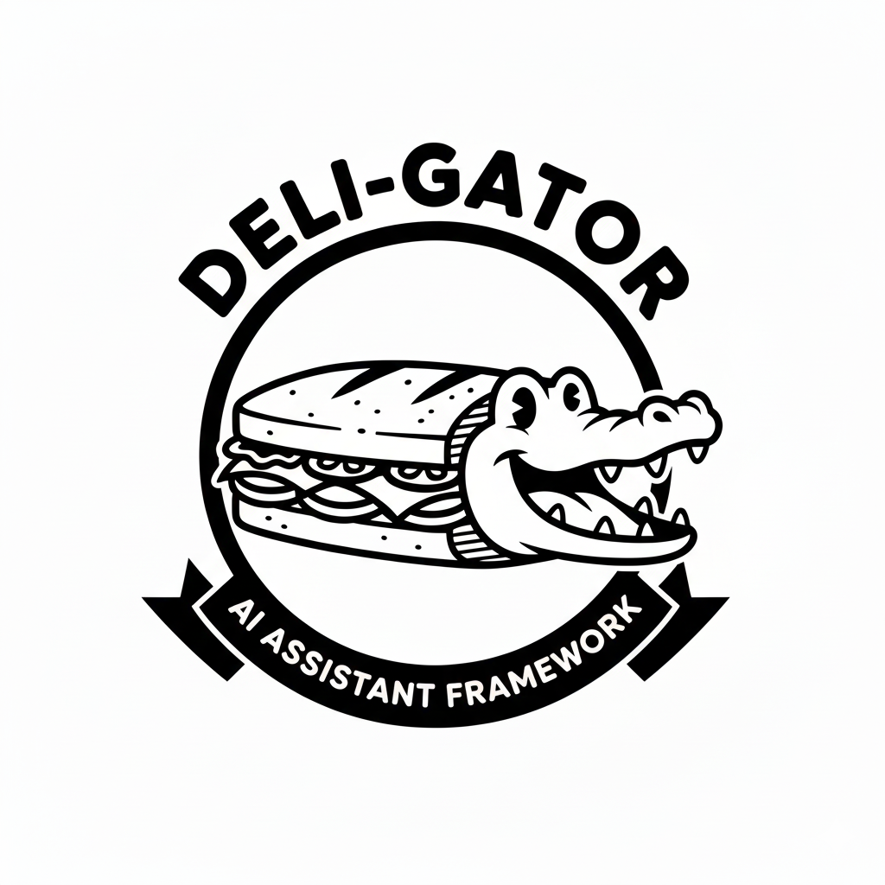

<div align="center">
  

  **NEW: [Blog post added](docs/architecture-blog-post.md)** - Deep dive into the delegation pattern
</div>

# Deli-Gator: AI Assistant Delegation Architecture

> **Delegation + Agents = Deli-Gator** 🐊

An architectural pattern for building AI assistants that don't forget. Keep your main context clean by delegating API queries and specialized tasks to sub-agents.

## The Problem

When working with AI assistants like Claude, every API interaction pollutes your main context:

```
❌ Before: Monolithic Context
User: "Show me my cloud instances"
Assistant loads 5-10KB of:
- API documentation
- Authentication patterns
- Shell command syntax
- JSON parsing logic

Result: Context bloated, conversations forgotten
```

## The Solution

Delegate specialized tasks to sub-agents running cheaper models:

```
✅ After: Delegation Pattern
User: "Show me my cloud instances"
Main Assistant (< 1KB):
  - Recognizes keyword
  - Delegates to Cloud Sub-Agent
  - Presents results

Sub-Agent (5-10KB, cheaper model):
  - Reads AGENT-INSTRUCTIONS.md
  - Uses shell wrappers
  - Returns clean results

Result: 50-70% cost savings, clean context
```

## Quick Start

### 1. Pick a Service

Start with your most-queried API:
- Cloud infrastructure (AWS, Azure, GCP)
- Monitoring systems (New Relic, Datadog)
- Project tracking (Jira, GitHub, Linear)
- Documentation (Confluence, Notion)

### 2. Build Shell Wrappers

Create 5-7 guard-railed scripts:

```bash
#!/bin/bash
# ~/bin/service-operation

# Embedded authentication
TOKEN="your-token"

# Clean, formatted output
curl -s -H "Authorization: Bearer $TOKEN" \
  "https://api.example.com/endpoint" \
  | jq -r '.data[] | "\(.id): \(.name)"'
```

### 3. Write Agent Instructions

Create `AGENT-INSTRUCTIONS.md`:

```markdown
## Decision Tree

User asks "show my items"?
  → Use service-mine

User provides ID?
  → Use service-show <ID>

User searches by keyword?
  → Use service-search "<query>"
```

### 4. Add Forceful Documentation

Create startup doc that loads every session:

```markdown
⛔ CRITICAL: Service Query Delegation

IF user mentions: service, item, resource
THEN delegate to sub-agent. DO NOT handle directly.
```

### 5. Test

Start fresh session and verify:
- ✅ Delegation happens automatically
- ✅ Sub-agent chooses correct tool
- ✅ Results are accurate
- ✅ Main context < 1KB

## Repository Structure

```
deli-gator/
├── README.md                  # This file
├── docs/
│   ├── architecture-blog-post.md    # Detailed explanation
│   └── implementation-guide.md      # Step-by-step guide
├── templates/
│   ├── SKILL.md.template           # Main delegation logic
│   ├── AGENT-INSTRUCTIONS.md.template
│   ├── startup-doc.md.template     # Forceful documentation
│   └── shell-wrapper.sh.template   # Guard-railed script
└── examples/
    ├── cloud-infrastructure/       # Complete example
    ├── monitoring-system/
    ├── project-tracking/
    └── documentation-system/
```

## Benefits

### Cost Savings
- **50-70% reduction** in expensive model token usage
- Main context stays < 1KB per query
- Sub-agents use cheaper models

### Scalability
- Add services without bloating main context
- Each service is independent
- Test in isolation

### Reliability
- Guard rails prevent dangerous operations
- Tested patterns (shell wrappers work before automation)
- Sub-agents can self-heal through iteration

### Knowledge Preservation
- Main assistant doesn't forget important context
- Specialized knowledge stays in sub-agents
- Clean separation of concerns

## Time Investment

Per service:
- **1 hour:** Build and test shell wrappers
- **1 hour:** Write agent instructions and delegation skill
- **30 min:** Create forceful documentation
- **30 min:** Test in fresh session

**Total:** ~3 hours per service

**ROI:** 50-70% cost savings on all queries forever

## Architecture Layers

1. **Recognition** - Keywords trigger delegation
2. **Shell Wrappers** - Guard-railed, tested scripts
3. **Agent Instructions** - Complete domain knowledge
4. **API Documentation** - On-demand via Context7 MCP
5. **Delegation Skill** - How to invoke sub-agent
6. **Testing Protocol** - Validate end-to-end
7. **Self-Healing** - Sub-agents discover solutions

## Example: Cloud Infrastructure

**Shell Wrappers:**
```bash
~/bin/cloud-instances-list    # List compute instances
~/bin/cloud-storage-list      # List storage buckets
~/bin/cloud-iam-keys          # List IAM keys
~/bin/cloud-deploy            # Deploy services
~/bin/cloud-profile           # Manage profiles
```

**Keywords:**
`cloud, compute, storage, iam, container, instance`

**Test:**
```
User: "list running cloud instances"
Main: [delegates automatically]
Sub-Agent: cloud-instances-list --state running
Result: 122 instances, < 1KB main context
```

## Getting Started

### Option 1: Use Templates

```bash
# Copy template structure
cp templates/SKILL.md.template \
   your-skill/delegating-to-service-agent/SKILL.md

# Customize for your service
# Follow implementation-guide.md
```

### Option 2: Study Examples

```bash
# See complete implementations
cd examples/cloud-infrastructure/
ls -la

# Adapt to your service
```

### Option 3: Follow Guide

Read `docs/implementation-guide.md` for step-by-step instructions.

## Success Criteria

Your delegation is successful when:
- [ ] Fresh session recognizes keywords automatically
- [ ] Delegation happens without user prompting
- [ ] Sub-agent chooses correct wrapper
- [ ] Results are accurate and well-formatted
- [ ] Main context stays < 2KB
- [ ] Works first try, every time

## Learn More

- **Blog Post:** [docs/architecture-blog-post.md](docs/architecture-blog-post.md) - Detailed explanation with examples
- **Implementation Guide:** [docs/implementation-guide.md](docs/implementation-guide.md) - Step-by-step instructions
- **Templates:** [templates/](templates/) - Copy and adapt for your services
- **Examples:** [examples/](examples/) - Complete implementations

## Contributing

Have you built delegation for a service? Share it!

1. Fork this repo
2. Add your example to `examples/`
3. Submit a pull request

Services we'd love to see:
- GitHub API
- Linear
- Datadog
- PagerDuty
- Terraform Cloud
- Kubernetes
- Docker
- Your favorite API!

## License

MIT License - Use freely, adapt for your needs

## Credits

Created by Ryan Nelson ([@ryancnelson](https://github.com/ryancnelson))

Inspired by microservices architecture and the need to keep AI assistants focused.

Built with Claude Sonnet 4.5, which itself uses this pattern. Meta? Yes. Effective? Absolutely.

## Questions?

Open an issue or reach out on GitHub!

---

**Remember:** The best architecture is the one that scales. This pattern lets you add infinite services without forgetting what matters.

🐊 Happy delegating!
